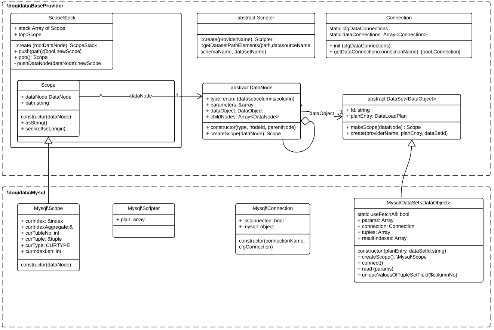

# doq
## PHP Documented Objects Queries

### Description
DQO allows you to declare entities attribute relations (aggregation, composition) via JSON-like configuration. 
Doq Scripter (for now only MySQL) builds SQL queries and store this to Cache. Data could be stored in different databases. Doq carefully aggregates data from separated databases throw corresponding data provider. After aggregation the collected data is provided as Dataset.


### Описание

Doq позволяет составлять описание взаимосвязей между атрибутами сущностей (агрегация, композиция) в виде JSON подобной конфигурации. 
Doq Scripter (на данный момент только для MySQL провайдера) построит SQL запрос для таблицы соответствующего провайдера. Doq последовательно собирает связанные между собой данные у разных провайдеров, объединяет их и предоставляет в виде универсального объекта Dataset, допускающего вложенные узлы данных Datanode (иерархические запросы).

Example of a data schema configuration
Пример описания схемы данных

### Schema
```php
   [
    '@datasources'=>[
      'main'=>[
        '#dataConnection'=>'MySQL1',
        '@schemas'=>[
          'store'=>[
            '@datasets'=>[
              # dataset in the schema 'mystore' uses in model 'main' (type = 'memory')
              'PRODUCT_GROUPS'=>[
                '#refKind'=>'tree', # = list for dictionaries, = tree for small navigation trees, = table for tables printing via DataGrid
                '#label'=>'Das ist Product groups',
                '@fields'=>[
                  'PRODUCT_GROUP_ID'=>['#type'=>'int64','#isAutoValue'=>'1'],
                  'PARENT_ID'=>       ['#type'=>'int64','#refKind'=>'lookup','#ref'=>'store/PRODUCT_GROUPS'],
                  'NAME'=>            ['#type'=>'string','#size'=>'80'],
                  'SUB_NAME'=>        ['#type'=>'string','#size'=>'80'],
                  'TITLE'=>           ['#type'=>'string','#size'=>'180']
                ],
                '#keyField'=>'PRODUCT_GROUP_ID',
                '#nesting'=>['#rootId'=>0,'#parentIdField'=>'PARENT_ID']
              ],
              'PRODUCTS'=>[
                '#refKind'=>'table',
                '@fields'=>[
                  'PRODUCT_ID'      =>[
                    '#type'=>'int64',
                    '#isAutoValue'=>1
                    ],
                  'PRODUCT_GROUP_ID'=>[
                    '#type'=>'int64',
                    '#refKind'=>'lookup',
                    '#ref'=>'main:store/PRODUCT_GROUPS'],
                  'PRODUCT_SECOND_GROUP_ID'=>[
                    '#type'=>'int64',
                    '#refKind'=>'lookup',
                    '#ref'=>'main:store/PRODUCT_GROUPS'],
                  'PRODUCT_TYPE_ID1' =>[
                    '#type'=>'int64',
                    '#refKind'=>'lookup',
                    '#ref'=>'memdata:store/PRODUCT_TYPES',
                    ],
                  'PRODUCT_TYPE_ID2' =>[
                    '#type'=>'int64',
                    '#refKind'=>'lookup',
                    '#ref'=>'memdata:store/PRODUCT_TYPES',
                    ],
                  'PARAMETERS'=>[
                    '#type'=>'virtual',
                    '#refKind'=>'aggregation',
                    '#ref'=>'memdata:store/PRODUCT_PARAMETERS'
                    ],
                  'TITLE'=>['#type'=>'string','#size'=>80],
                  'SKU'=>['#type'=>'string','#size'=>30],

                ],
                '#keyField'=>'PRODUCT_ID'
              ],
            ],
          ]
        ],
      ],

      'memdata'=>[
      	'#dataConnection'=>'Mongodb1',
        '@schemas'=>[
          'store'=>[
            '@datasets'=>[
              'PRODUCT_TYPES'=>[
                '#kind'=>'list',
                '@fields'=>[
                  'PRODUCT_TYPE_ID'=>[
                    '#type'=>'int64',
                    '#isAutoValue'=>1,
                  ],
                  'NAME'=>[
                    '#type'=>'string',
                    '#size'=>50
                  ]
                ],
              '#keyField'=>'PRODUCT_TYPE_ID'
              ],
              'PARAMETERS'=>[
                '@fields'=>[
                  'PARAMETER_ID'=>['#type'=>'int64'],
                  'PARAMETER_GROUP_ID'=>['#type'=>'int64'],
                  'NAME'=>['#type'=>'string','#size'=>'100'],
                  'UNITS'>['#type'=>'string','#size'=>'50']
                ],
                '#keyField'=>'PARAMETER_ID'
              ],
              'PRODUCT_PARAMETERS'=>[
                '@fields'=>[
                  'PRODUCT_PARAMETER_ID'=>['#type'=>'int64'],
                  'PARAMETER_ID'=>['#type'=>'int64'],
                  'VALUE_STRING'=>['#type'=>'string','#size'=>'250'],
                  'PRODUCT_ID'=>[
                    '#type'=>'int64',
                    '#refKind'=>'lookup',
                    '#ref'=>'main:store/PRODUCTS'
                  ],
                ],
                '#keyField'=>'PRODUCT_PARAMETER_ID'
              ]
            ]
          ]
        ]
      ]
    ]
  ];

```


### Result
Result is a linked Dataset that contains queries execution plan.
If subqueries belongs to the same connection doq uses JOIN syntax.
If subqueries belongs to different connections doq keep them in the plan depends on parent queries.

Результат обработки связей - последовательный план выполнения запросов к разным соединениям провайдеров.
Если несколько подзапросов относятся к одному соединению, то производится автоматический JOIN.
Если подзапросы относятся к разным соединениям, то сначала выполняется базовый запрос, лишь затем - зависимые запросы.

```sql
-- 1
SELECT ta1.PRODUCT_ID, ta1.SKU, ta1.TITLE, ta1.PRODUCT_GROUP_ID, ta2.NAME, ta2.TITLE, ta2.PARENT_ID, ta3.NAME,
   ta1.PRODUCT_SECOND_GROUP_ID, ta4.NAME, ta1.PRODUCT_TYPE_ID1 FROM 
((products AS ta1 LEFT JOIN product_groups AS ta2 ON ta1.PRODUCT_GROUP_ID=ta2.PRODUCT_GROUP_ID)
LEFT JOIN product_groups AS ta3 ON ta2.PARENT_ID=ta3.PRODUCT_GROUP_ID)
LEFT JOIN product_groups AS ta4 ON ta1.PRODUCT_SECOND_GROUP_ID=ta4.PRODUCT_GROUP_ID;

-- 2
SELECT ta1.PRODUCT_PARAMETER_ID, ta1.PRODUCT_ID, ta1.PARAMETER_ID, ta2.NAME, ta1.VALUE_STRING 
FROM product_parameters AS ta1 LEFT JOIN parameters AS ta2 ON ta1.PARAMETER_ID=ta2.PARAMETER_ID 
WHERE (ta1.PRODUCT_ID IN (1,2,3,4,5,6,7,8,9,10,11,12,13,14,15,16,17,18,19,20,21,22,23,25,26,27,28,29,30,31,32,33,34));

-- 3
SELECT ta1.PRODUCT_TYPE_ID, ta1.NAME FROM 
product_types AS ta1 WHERE (ta1.PRODUCT_TYPE_ID IN (1,2));

```

## Doq classes diagram



